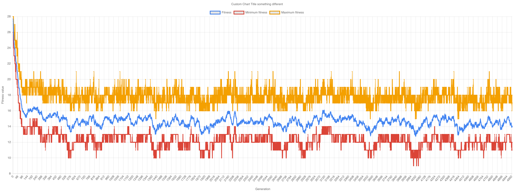
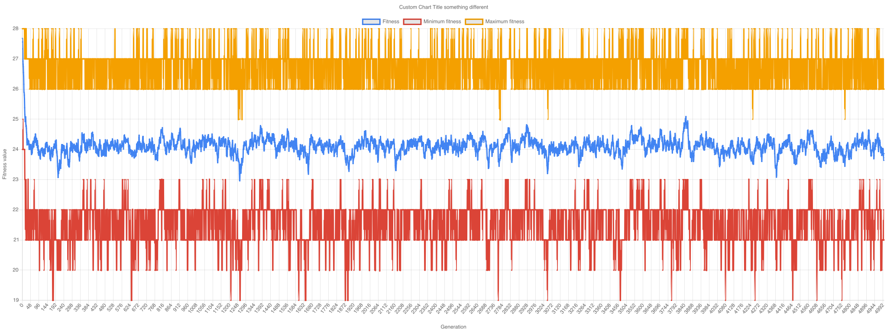
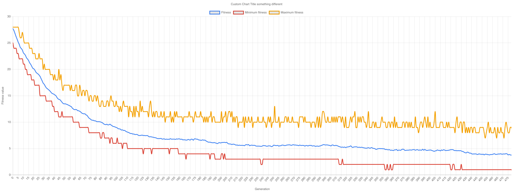
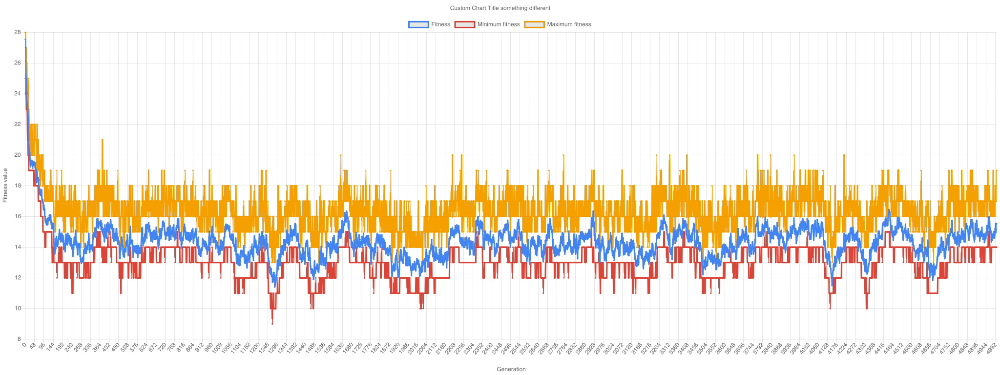
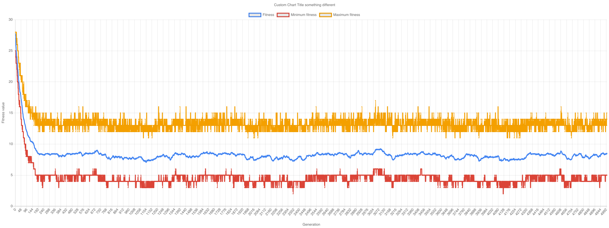
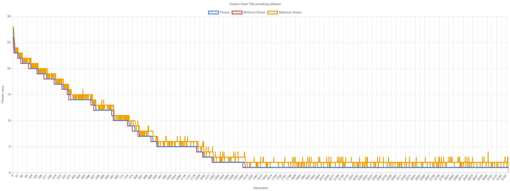

# Genetic algorithm for Stringfinder
<!-- section: Introduction -->
<!-- Describe briefly what your software is. What problem does it solve? At what target audience is it aimed? -->
This is a sandbox project for understanding what genetic algorithms are and how they work. Generally speaking genetic 
algorithms are meta heuristics. They are used to generate solutions for complex problems. The benefit is that it produces
high quality solutions in a very short time. Although they not always converge on the optimum solution the results are
often usable and produced really quickly.

## How they work
Genetic algorithms are inspired by nature itself. We start out with a population zero of a given size `p`. Each so called
chromosome in the first generation is measured by a fitness function, which describes how well the chromosome is doing.
We then use a limited number of the best chromosomes to mate with each other. How mating is done and how we combine
chromosomes to create new ones are tightly coupled to the problem (i.e. environment). Furthermore we may introduce some
mutation and start over with our new generation. Let's see this on an example:

## Example
Consider the following problem: We want to generate a string, which matches a given string `s` - for example 'Hello World'.
We start out with a population zero if size `p` with random strings. We define a fitness function, which calculates 
the sum of different characters for a given chromosome and `s`. That way a string, which matches `s` will have fitness 0,
which is our optimum. We then take a limited number of our generation and let them mate. Mating works (for example) by 
taking an arbitrary candidate and mate it with another arbitrary candidate (except itself). Once we have two distinct 
candidates, we do a crossover. This means that we combine them, such that the resulting chromosome, will have genes from
both parents. A simple crossover would be that the resulting chromosome consists of a half of either parent (e.g. 'Hello World!' + 'Good Morning' -> 'Hello rning').
Last thing to do is mutation. In our case mutation is a small chance, that a single character alters. we receive a new 
population and the cycle starts again until we get a population with our given string `s` (or we reach a limit).

## Results
### Default
* Word: Hello World!'
* Population size: 100
* Limited number of population used for mating: 60
* Mutation chance : 5%
* Some chromosomes from last generation: H;lWo#World!, Hell'IWor!d!, Hello#Worlde, He\"lo6World<, HelloGWorVd!,



### High Mutation
* Word: Hello World!'
* Population size: 100
* Limited number of population used for mating: 60
* Mutation chance : 15%
* Some chromosomes from last generation: ?elf&gDGWlr5, H%*v&[%oqlNr, pex[7dKoXz&!, He6!Tv>nZl0#, 3e6&ohnkrf;E

This setting converges at a high fitness score. Hence it is not suitable for our given problem. The reason for that is 
that by mutating too often chromosomes, which are already similar to our given string `s` are getting changed too much. 



### High Population
* Word: Hello World!'
* Population size: 500
* Limited number of population used for mating: 200
* Mutation chance : 5%
* Some chromosomes from last generation: HellolWo|ld!, HellowWo=ld!, HelloTWoGld!, HellolWo.ld?, _ello Wo}ld!

This setting converges really fast. Actually it was almost always the best setting for this problem at any given string length.
Having a large population of candidates obviously is advantageous. Interestingly we get nearly optimum solutions at a 
quarter of maximum number of generations. 



### Low Population
* Word: Hello World!'
* Population size: 20
* Limited number of population used for mating: 10
* Mutation chance : 5%
* Some chromosomes from last generation: HelloxWorld!, Hello+Wo_lK!, HelloxWorld!, HelloFWorld!, $eZl>FWArld!

As a contrast having low population count does not converge at an optimum. It gets stuck at a high fitness value and is
not able to overcome this due to a lack of mating partners and diversity. Maximum and minimum fitness value for each 
generation are similar.



### Super High Population
* Word: Hello World!'
* Population size: 1000
* Limited number of population used for mating: 500
* Mutation chance : 5%
* Some chromosomes from last generation: -

Since high population got us the best results, we should increase the population count once more, right? Wrong! Having 
too much diversity leads to too many mating partners increasing the pool in terms of quantity but not quality. 



### Zero Mutation
* Word: Hello World!'
* Population size: 100
* Limited number of population used for mating: 60
* Mutation chance : 0.1%
* Some chromosomes from last generation: HelloQWorld!, HelloQWorld!, HelloQWorld!, HelloQWorld!, HelloQWorld!

This setting converges but takes more time as the same setting with higher mutation. Mutation helps to outbreak local 
minimum solutions, which are only strengthened by mating.



## Run it your self
You can run this your self. There are a set of profiles and a suite in this repository.

### Profiles
A profile is a set of information needed by the genetic algorithm to run. Example profiles are located under `./input/profiles`.

Simply run

    node index.js --profile default --output chart "Hello World"
    
The following options are supported: 

| Name | Description | 
|:-|:-|
| profile | The name of the profile yml file, which is located under `./input/profiles` |
| output | Defines either a single or multiple renderers. Currently supported: `chart`, `json`, `console`. Default is `console` |
| verbose | Enables verbose option. Can be up to trippled (i.e. -vvv) |
| word | The actual string `s` to search for |

### Suites
A suite runs one or more profiles for a given word, such that profiles can be compared to each other in an easy way. 
Profile options, like output and word are specified globally for a suite.

Simply run

    node index.js --suite helloWorldSuite
    
The following options are supported: 

| Name | Description | 
|:-|:-|
| suite | The name of the profile yml file, which is located under `./input/suites` |

## Contributing
Bug reports and pull requests are welcome on GitHub at https://github.com/[dasheck0]/genetic-algorithm-stringfinder. This project is intended 
to be a safe, welcoming space for collaboration, and contributors are expected to adhere to the Contributor Covenant code of conduct.

## License

```
ISC License

Copyright (c) 2019, Stefan Neidig

Permission to use, copy, modify, and/or distribute this software for any
purpose with or without fee is hereby granted, provided that the above
copyright notice and this permission notice appear in all copies.

THE SOFTWARE IS PROVIDED "AS IS" AND THE AUTHOR DISCLAIMS ALL WARRANTIES
WITH REGARD TO THIS SOFTWARE INCLUDING ALL IMPLIED WARRANTIES OF
MERCHANTABILITY AND FITNESS. IN NO EVENT SHALL THE AUTHOR BE LIABLE FOR
ANY SPECIAL, DIRECT, INDIRECT, OR CONSEQUENTIAL DAMAGES OR ANY DAMAGES
WHATSOEVER RESULTING FROM LOSS OF USE, DATA OR PROFITS, WHETHER IN AN
ACTION OF CONTRACT, NEGLIGENCE OR OTHER TORTIOUS ACTION, ARISING OUT OF
OR IN CONNECTION WITH THE USE OR PERFORMANCE OF THIS SOFTWARE.
```
